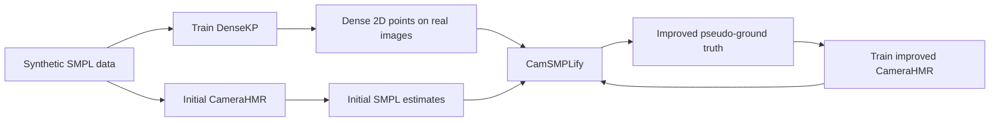

## CameraHMR: the core idea

The paper tackles monocular 3D human pose and shape estimation: given a single image, predict the person’s 3D body shape, pose, and position relative to the camera. The challenge is that we have images, but usually do not have reliable 3D meshes corresponding to those images.

The authors begin with a perspective camera model. A 3D point in camera coordinates is projected into the image using the camera’s focal length and principal point:

$$
x=f_x\frac{X}{Z}+c_x,
\qquad
y=f_y\frac{Y}{Z}+c_y.
$$

However, the focal length alone is not enough to characterize the camera, because the same focal length can produce different views with different sensor sizes. The authors therefore predict the image’s **vertical field of view** using a model called HumanFoV. The field of view is a more direct description of how much of the scene the camera captures. HumanFoV’s prediction is then converted into the focal length needed for perspective projection. [Camera model](https://www.alphaxiv.org/abs/2411.08128?page=3)

A second problem is that real-image datasets often contain only sparse 2D body joints—typically around 17 points. These joints are useful for describing pose, but they do not provide enough information about the person’s surface or body shape. Two people might have similar shoulder, elbow, hip, and knee locations while having very different body widths or proportions.

To address this, the authors train a dense surface keypoint detector called DenseKP. They use synthetic datasets such as BEDLAM and AGORA, where the underlying SMPL body mesh and camera parameters are known. From each known SMPL mesh, they select 138 informative surface vertices and project them into the rendered image. These projected points become the 2D training targets for DenseKP. [Dense surface keypoints](https://www.alphaxiv.org/abs/2411.08128?page=5)

The selection of 138 vertices is important. They do not simply project all 6,890 SMPL vertices into the image, because that would be excessive and highly redundant. Instead, they use a geometry-aware down-sampling strategy inspired by [CoMA](https://www.alphaxiv.org/abs/1807.10267). The general idea is to simplify the mesh while preserving regions where the surface changes significantly—for example, around bends, contours, joints, and other geometrically informative areas. The exact CameraHMR implementation is described only briefly, so it is safest to view this as a CoMA-inspired mesh simplification process rather than as a literal selection of only the mathematically highest-curvature vertices.

DenseKP can then be applied to real images in the 4DHumans dataset. For each image, the authors now have:

- the original sparse 2D body joints;
- 138 additional estimated 2D surface keypoints;
- an estimated camera model from HumanFoV.

The next stage is **CamSMPLify**. It is important to distinguish this from CameraHMR: CamSMPLify is not a neural network that learns to predict meshes. It is an optimization procedure.

The authors first obtain an initial SMPL estimate using an earlier CameraHMR model. This provides an initial body pose, body shape, and camera-space translation. CamSMPLify then adjusts the SMPL parameters so that the projected 3D body agrees with the image evidence. It minimizes an objective involving:

- the reprojection error of the 17 body joints;
- the reprojection error of the 138 dense surface keypoints;
- regularization terms that discourage implausible body shapes or excessive deviation from the initial prediction.

In simplified form:

$$
E(\beta,\theta,t)
=
\lambda_S E_{\text{surface}}
+
\lambda_J E_{\text{joints}}
+
E_{\text{regularization}}.
$$

Here, $\beta$ represents body shape, $\theta$ represents pose and global orientation, and $t$ represents the body’s translation in camera space. The joint term mainly constrains the skeleton and pose, while the surface-keypoint term provides additional information about the body’s shape and image alignment. [CamSMPLify objective](https://www.alphaxiv.org/abs/2411.08128?page=6)

The refined SMPL fits produced by CamSMPLify are treated as **pseudo-ground truth**. They are not perfect 3D measurements, but they are better aligned with the real images than the original estimates. These refined fits are then used to train a new version of CameraHMR.

The overall process is therefore iterative:

In short:

> Synthetic datasets provide accurate 3D bodies and cameras. These are converted into dense 2D surface-keypoint labels to train DenseKP. DenseKP supplies additional 2D evidence on real images. CameraHMR provides an initial SMPL prediction, and CamSMPLify optimizes that prediction using joint and surface-keypoint reprojection errors. The improved fits become pseudo-ground truth for training a better CameraHMR, and the cycle is repeated.

The main contribution is therefore not just a new mesh regressor. It is a complete strategy for creating better supervision from images that originally lack reliable 3D annotations: **better camera estimation, denser 2D evidence, optimization-based refinement, and iterative retraining.**

