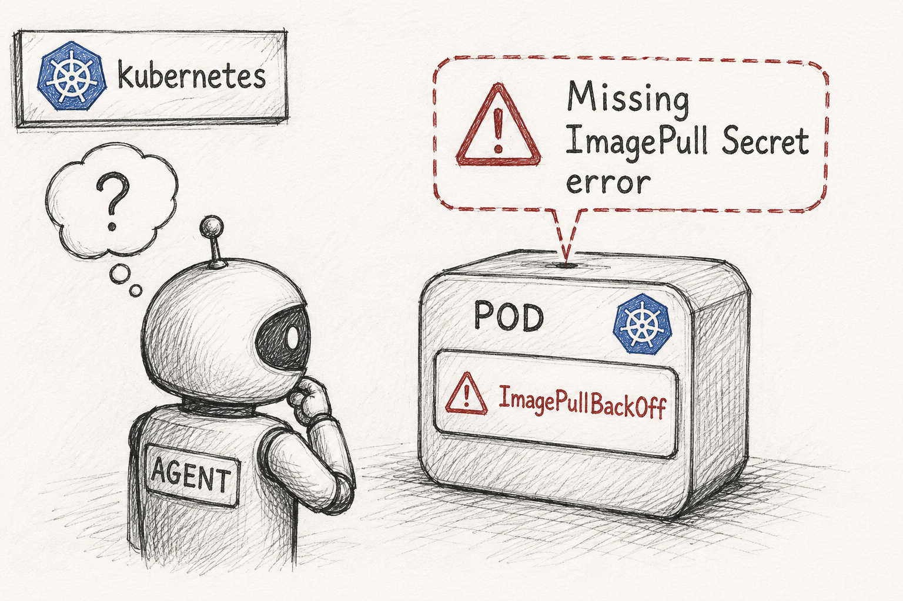

So our initial PR (which closely mimicked the Reddit PI Day Outage) was not novel enough, partly because I had missed a few existing issues that were created recently and also because I ended up framing the PI day outage itself in the wrong way. But we are back!! With another issue, had to dig a few places for these because the rate with which the candidates are proposing issues and patching them up has become breath-taking. Anyways, let's get to it:

So the problem stems from a issue that was opened in the official Kubernetes repoitory - [#41896](https://github.com/kubernetes/website/issues/41896), and which was subsequently patched in the PR - [#117927](https://github.com/kubernetes/kubernetes/pull/117927). The crux of the issue it this:

Pods in Kubernetes are the smallest self-sustaining unit of kubernetes which can run an application, which we have already seen in the previous post. And a pod may contain one or more docker containers which it manages. Now, when a pod starts, it's configuration specifies the container images it requires and the container then pulls those images to get the application running. And as you would know, docker containers can either be public or private. Public docker containers, do not need any authentication to be pulled, while private containers do - the term for the authentication keys is "image pull secrets", and the issue [#41896](https://github.com/kubernetes/website/issues/41896) pointed out that in earlier versions of kubernetes, if any of these image-pull-secrets were missing, the pod would fail to start BUT WITHOUT ANY WARNING or LOGS. And this was exactly that was patched in [#117927](https://github.com/kubernetes/kubernetes/pull/117927).

However there is a caveat here - the patch introduced in [#117927](https://github.com/kubernetes/kubernetes/pull/117927) would emit a warning even for public docker images. That is, for a pod trying to pull from a public docker image without a valid `imagePullSecrets` (which it does not need here), it would still emit a warning. And if you have ever dealt with cloud applications deployed using kubernetes, you woudl know that there are a hell lot of logs that get registered at every step. This is what this issue is all about - [#128544](https://github.com/kubernetes/kubernetes/issues/128544). Now, all the story aside, the question that lay infront of me was - how can I use these series of events to design a prioblem that would be difficult for an agent to tackle.

## The Problem at a glance

So the challenge for the agent would be investigate the cluster, figure out that the pod is failing to start because of missing image pull secrets and is emitting ImagePullBackOff Errors - and then check the specific reasons for the cluster's ImagePullBackOff Errors - which would be missing credentials, find those missing credentials and then 
patch the broken pods to ensure that the cluster is back up again safely and it works. But ofcourse there are many more intricate details to this, because we must simulate the entire thing in the SREGym environment for the agent to be able to work in, and this time we went on to tackle a pretty interesting challenge - trying to simulate the problem for local kind-based clusters + cloud based aws instances, so let's get into it:

## The initial setup

So to list out the things we must get done:
1. Launch the hotel-reservation app, wait for it to be up.
2. Now, as default, the application just pulls from public docker images available in docker hub and don't really need a secret or an auth key.
3. Sooo, we must take the public image and then somehow, make it private!!! There is an obvious way to do this - just pull from a private docker image, but that comes with the headache of having to maintain the secret and keeping track of auth changes.
4. As highlighted above, we cannot just switch to using a private docker image, so instead, we pull the image and push it to a private docker registry that we create in our self-hosted cluster and assign it an auth key. Clever, eh?
5. The entire inject_fault() pipeline involves deletion of the image pull secret, adding the public docker image to the private one and then pointing the pod to pull from the private docker image instead of the public one.
6. A key caveat here is that the mitigation for this broken image pull secret involves reconstructing the image pull secret, but how does an agent reconstruct the secret if it has never seen it? Random guessing won't cut it I think. So, we also leave breadcrumbs pointing at the credentials registry with enough information for the agent to reach and reconstruct the secret.
7. Once the secret has been added to the namespace, the agent must force the the pod to restart to pull the image from the private docker registry, and the most straightforward way of doing it is to just delete the pod, and upon restart, it is forced to pull the image again with the udpated image secret.
8. Another sort of a tangent that we would be taking later in this article would be about setting up this cluster on aws - which trust me was a pain.

## Defining the problem and simulating it in SREGym

So when creating a new problem in SREGym we need to do a few key things - write a wrapper of sorts either around one of the many applications that SREGYm provides or maybe if you are too savvy - writing a new one. And as you will see later in teh post, I for one really hopskipped across a few applications to base my problem around. But the application is not really that consequential here, the primary thing to focus on here is the what fault do you inject in the pipeline, what components do you break and how do you fix it. Now we have already given the overview of what the problem looks like in the section above, here I will go a bit deeper.

So as I said the choice of application is not really that consequential here and the reason for that being that all the applications that SREGym provides all follow similar structures. Each application runs in a kubernetes cluster, with a few services and pods running in a namespace. Each pod, runs one or more containers, and each container runs an application. For those wondering where a Node comes in this heirarchy, the node is just the machine where this all runs. The Node is just the physical or virtual machine where the pod runs, so if I spin up an AWS instance for the task, that AWS instance becomes my node.

So every SREGym application has a few pods running different services in a namespace. Each service representative of the function it is intended to do. For example, in the hotel reservation app, there is a service for recommendations, and one for payments etc. And each pod pulls a docker image in order to run the required service, remember this point because this single fact will dictate how we simulate our fault. 

## Okay, but where do you get the nodes
Given that these applications requried VMs/clusters to run, what are our options here. The SREGym framework very conveniently comes with the ability to use both kind and real K8s clusters on the cloud along with the directions to do so, and I will touch upon very briefly on how they do this. Also remember that the platform you choose in order to simulate your kubernetest cluster on also dictates how you will implement the fault itself because it alters the way you interact with the host machine.

#### Be Kind, Rewind

So the first option is to use Kind. Kind is a lightweight tool for running local Kubernetes clusters in Docker containers. There is an interesting catch about using kind though that people often get wrong. So based on the description that we have given about pods in this and the previous posts, it is easy to assume that the node in a kind cluster - which is running in a docker container, spins up a docker container inside itself for the pods. However that is not correct. Docker as a platform, does a bunch of things that your pods do not need. So, instead of spinning up another docker container inside the node for a pod, it just uses containerd - the docker runtime to create separate namespaces for each pod and setup the required images. Containerd pulls the docker images for the respective pods which owns them and distributs storage and networkiing services among them.

And in the case of SREGym, the authors have generiously included a bash in the codebase that just sets up a kind cluster on your local machine so that you are good to go! Now this bash does a few things:

1. For any kubernetes cluster to work, the standard recommendation is to have three nodes - one control plane and two worker nodes, and the bash creates three docker containers to serve as these nodes. The control plane is responsible for managing the cluster's state, scheduling workloads and making decisions. If that single control plane node fails, the entire cluster goes down. 

The worker nodes, each run `kubelet` which communicates with thr control plane and ensures that the containers are running as expected. Now, in the case of kind, the node itself is a docker container, so this `kubelet` is running inside a docker container. But besides that a key thing worth mentioning here is that the containers on the worker nodes are managed via a scheduler running on the control plane. So in the scenario where any of your *worker* nodes were to fail, the scheduler would just respawn the containers on the remaining nodes. 

2. The bash also installs all the necessary components that we discussed (grafanna, openEBS etc.) on the cluster so that it is ready to go.

#### Welcome to the Jungle

Well, kind clusters are sort of meant for local development and testing, hence an actual application is usually deployed on the cloud, so well, I set out to emulate the same on an AWS cluster and all I can say is that it was a safari. AWS offers pretty generous free tiers, and you can get up and running with any flavor of Ubuntu in no time. The authors have also provided guidelines and steps to get started with a AWS cluster; we use `ansible`- that handles all the configuration, application deploymeny and other quirks for us. However the default `setup.yml` provided had a few steps that would mess up my AWS setup so I had to disable them. For instance, one of the steps involved changing the kernel image from `6.17.3` to `6.8.0-generic` and for some reason, the EC2 instances were not cool with that.

Another crucial change - and this might actually be a tip for people trying to work out SREGym on free tiers of AWS, YOU MUST ALSO LOWER THE `ChunksCache: allocatedMemory` down to 1024 from 8092 MBs in `loki-values.yaml` which essentially decides how much memory is allocated to the individual chunks that Loki creates to store and read frequent logs that is if you are on the aws free tier and are limited by the memory as I was.

However after all the wrestling with the setup, I finally was able to get three nodes on AWS running. But remember that each container must be able to communicate with the others too, as was the case in the kind cluster. So we must also enable all `node-to-node` communication within the security groups of the EC2 instances.

## Alright, time to mess around with the applications.

So now that we have our cluster up and running, we can finally get to the fun part - deploying the applications, and fiddling with the components so that something breaks - in a subtle way ofcours, you don't want an agent to be able to catch the fault with a blaring bug that stares at you just from the `kubectl logs` command. The SREGym framework comes with a few sample applications that we can use to test our setup. I chose the hotel reservation app for my experiments.

## So how do you actually break it?

The recipe, from the `inject_fault()` side, goes like this. First we stand up a private docker registry right inside the cluster - a plain `registry:2` pod with an `htpasswd` file so it actually demands a username and password (we went with `admin` / `portable_panda123`, **very** secure, I know). We pull the app's public image, retag it, and push it into this private registry. Then we patch the target deployment to point at `<registry>:5000/...:latest`, flip its `imagePullPolicy` to `Always`, and delete the `imagePullSecrets`. The pod restarts, tries to pull from a registry it has no credentials for, and lands squarely in `ImagePullBackOff`. Fault injected. We also sprinkle in a couple of decoy "logger" pods emitting the exact same `FailedToRetrieveImagePullSecret` warning, just so the signal isn't trivially isolated to one pod, which is intentionally designed to act as distractors for the agent.

*Image Credit - An agent ;) - ChatGPT

But here is the thing that took me embarrassingly long to appreciate: a clever agent doesn't need my secret at all. It can just point the deployment back at the original public image and set `imagePullPolicy: IfNotPresent`. The node already has that image cached from when the app first started, so the kubelet shrugs, uses the warm copy, and the pod goes green. No credentials, no real fix, oracle fooled. That is cheating, and I needed to slam that door shut.

Closing it took two locks:

1. **Block the public registries at the node itself.** We drop a tiny nginx that answers every request with a `403`, and redirect `docker.io` (and `ghcr.io`) to it. On the cri-dockerd AWS nodes this is an `/etc/hosts` entry; on the containerd/kind nodes it is a `certs.d/hosts.toml` mirror. Any fresh pull of a public image now fails.
2. **Purge the warm copy.** We reach onto the node(s) running the target and delete the cached public image (`docker rmi` / `crictl rmi`, via a short-lived privileged helper pod). Now `IfNotPresent` has nothing to fall back on, the re-pull is forced, and the block kills it.

## The flaw I walked straight into

Remember when I said the choice of app doesn't matter? I lied, a little. That targeted purge only works if the target's image is *unique* to that one service. Hotel reservation, it turns out, ships all eight of its microservices from a single shared image (`yinfangchen/hotelreservation:latest`). So purging "the target's image" off the node would yank it out from under seven perfectly healthy services, all of which would faceplant into the identical `ImagePullBackOff`. The blast radius becomes the whole app, and the agent's diagnosis turns to mush.

So I went app-hopping (told you I would). What I needed was one-image-per-pod, and two apps fit. OpenTelemetry's astronomy-shop demo gives every service the same repo but a *unique tag* (`ghcr.io/open-telemetry/demo:2.2.0-payment`, `:2.2.0-currency`, and so on). The Blueprint hotel reservation app gives every service a *unique repo* (`777lefty/docker-<svc>-service-container`). Either way, gating or purging one service's image has exactly zero collateral. Astronomy-shop is the heavy one (and it ate my poor AWS disk for breakfast, a storage saga for another day), Blueprint is the featherweight, so I ported the problem to both.

## Grading without leaking the answer

Two design problems remained. First, how do you grade a fix when there are a dozen legitimate ways to hand over credentials? I made the oracle *outcome-based* rather than pattern-matching: it checks that the target's pods are Running and Ready, that there is no image-pull failure, and - the anti-cheat clause - that the image is still pointing at the private `:5000` registry. Recreate the original secret, make a differently named one, attach it to the service account, whatever you like; if the pod is healthy and still pulling from the gated registry, you solved it honestly.

Second, and this is the subtle one: the fault must not leave a fingerprint that whispers the answer. No `original-image` annotation, no `fault-active` label, nothing that says "revert me to X". When recovery needs the original public image back, it doesn't read a stashed copy, it *derives* it from a sibling service (swap the tag suffix on astronomy-shop, swap the repo name on Blueprint), exactly the way a human operator would by looking around the namespace. The only breadcrumb we do leave is an honest one: a runbook ConfigMap and a master secret living in the registry's namespace that explain how to rebuild the credentials, because expecting the agent to conjure `admin` / `portable_panda123` out of thin air would just be cruel.

And when a run ends, cleanly or by a panicked Ctrl+C halfway through inject, a single `cleanup_leftovers()` reconstructs the whole mess from cluster signals alone (the `:5000` image marker, the block config, the decoy pods) and tears it all down. Order matters here: you unblock the registries *before* reverting the deployment, otherwise the pod can't re-pull the very public image you just handed back to it.

That, in a nutshell, is the fault. A missing secret, a private registry, two locks on the obvious cheat, an oracle that rewards honesty over reverting, and not a single annotation leaking the fix. The PR is live and on the SREGym github repo [#883](https://github.com/SREGym/SREGym/pull/883), I am hoping the maintainers (who were incredibly helpful btw) take a look and approve it :)